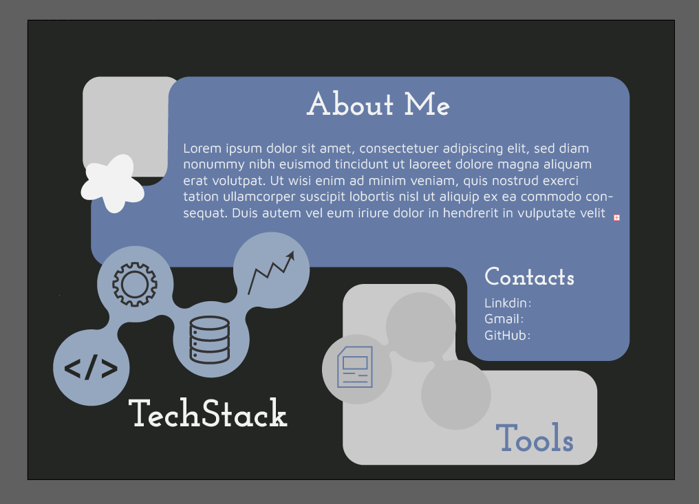
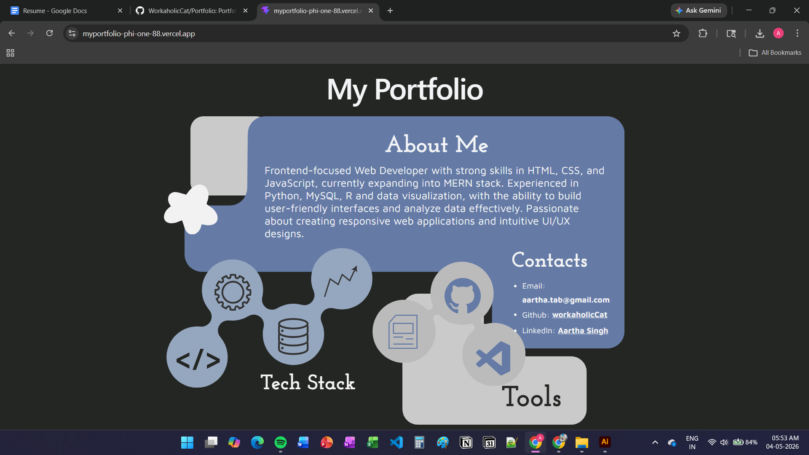

# 🚀 Portfolio: Concept to Production

This repository documents the engineering process of translating a high-fidelity visual concept into a functional, live-hosted web application.  
The project focuses on **layout precision, interactive UI states, advanced CSS layering, and modern deployment pipelines**.

---

## 🌐 Live Demo

👉 **https://myportfolio-phi-one-88.vercel.app/**

---

## 📸 Design Evolution

### 🎨 The Original Concept
The initial design featured a centralized interface with abstract geometric elements and decorative motifs to create a layered, modern aesthetic.
Created on : Adobe Illustrator

> 📌 

---

### 💻 The Live Deployment
The final application, built with React (Vite) and hosted on Vercel, successfully replicates the original vision with **pixel-perfect alignment and interactive accessibility**.

> 📌 

---

## 🛠️ Technical Challenges & Solutions

### 🔹 1. Advanced Layout with CSS Grid
Replicating the original design required a sophisticated approach beyond traditional layouts.

**Solution:**  
Implemented a **CSS Grid system** to define the structural skeleton, enabling precise positioning of overlapping cards and decorative elements while maintaining strict alignment with the original design.

---

### 🔹 2. Interactive Skill Discovery (Hover States)
Balancing a clean UI with detailed technical insights.

**Solution:**  
Used **CSS hover states combined with React state management** to dynamically reveal skill details when users interact with icons—keeping the UI minimal while enabling deeper exploration.

---

### 🔹 3. Pointer-Event Layering
Decorative background elements interfered with interactive UI components.

**Solution:**  
Applied:
```css
pointer-events: none;
```
to the decorative layer so visuals do not block clicks or hover interactions.

---

### 🔹 4. Stacking Context & Depth Management
Maintaining layered visual depth without cluttered CSS.

**Solution:**  
Established a structured **z-index hierarchy**:
- Background decorative layer  
- Main content container  
- Interactive UI elements  

---

### 🔹 5. Production Deployment with Vercel CI/CD
Moving from development to production required automation and reliability.

**Solution:**  
- Deployed via **Vercel**
- Integrated with GitHub for **Continuous Deployment (CD)**
- Automatic builds and global CDN distribution  

---

## 💻 Tech Stack

- **Frontend:** React (Vite)  
- **Layout:** CSS Grid & Flexbox  
- **Interactions:** CSS3 Transitions & Hover Effects  
- **Deployment:** Vercel (CI/CD)  
- **Development:** VS Code  

---

## ⚙️ Running Locally

### 1. Clone the Repository
```bash
git clone https://github.com/WorkaholicCat/Portfolio.git
cd Portfolio
```

### 2. Install Dependencies
```bash
npm install
```

### 3. Start Development Server
```bash
npm run dev
```

> Open the local URL shown in your terminal (typically http://localhost:5173)

---

## 📬 Contact

- 🐈 GitHub: https://github.com/WorkaholicCat  
- 💼 LinkedIn: Aartha Singh  
- 📧 Email: aartha.tab@gmail.com  

---

## 🛡️ License

This project is distributed under the **MIT License**.  
See the `LICENSE` file for details.

---
